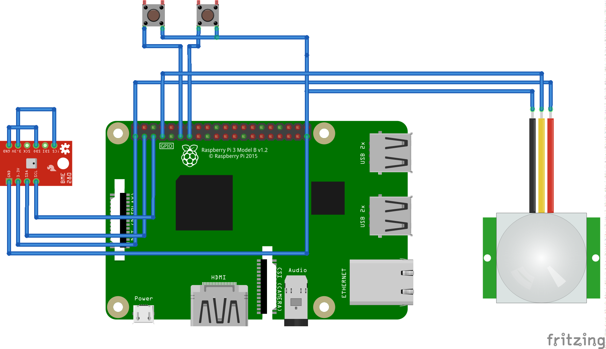

# InfoScreen
Some snippets / tools for my home info-screen on  a Raspberry Pi


Information coming from following blog-post:  
https://tangielskyblog.wordpress.com/2018/05/19/ein-ausschalter-fuer-das-raspberry-pi-display/ 

## Switch OFF Display

echo 1 | sudo tee /sys/class/backlight/rpi_backlight/bl_power > /dev/null


## Switch ON Display

echo 0 | sudo tee /sys/class/backlight/rpi_backlight/bl_power > /dev/null


## Switch TABS in Chromium

see : https://blog.gordonturner.com/2019/07/23/raspberry-pi-switch-chromium-browser-tabs/

## General Info 

* Some more general info also available here:
* https://www.elektronik-kompendium.de/sites/raspberry-pi/2111101.htm


## The Hardware, as of now




The PIR-Module (from Bastelgarage)


# Installation

1. Install Raspberry-Pi OS
2. Install clutter : sudp apt install unclutter
3. Install chromium : sudo apt install chromium
4. Install xdotool : sudo apt install xdotool
5. clone this repo
6. copy the file preparation/backlight-permission-rules to /etc/udev/rules.d/backlight-permission-rules , this allows non-root-users to control the backlight of the display
   (see also  https://linustechtips.com/topic/1246132-allow-non-root-user-to-access-sysclassbacklight/?do=findComment&comment=14015740 and https://linustechtips.com/topic/1246132-allow-non-root-user-to-access-sysclassbacklight/?do=findComment&comment=14015728 )
7. copy the file preparation/MyDashboard to /etc/init.d/. 
8. execute ```sudo update-rc.d MyDashboard defaults``` this will activate the three simple python http-servers, responsible for weather and clock in bin/start_dashboard
   see therefore also : https://tutorials-raspberrypi.de/raspberry-pi-autostart-programm-skript/
9. I have no clue how the other script in bin/ , called dashboard is triggered , appearantly NOT from the start_dashboard 
